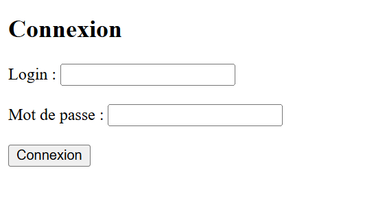
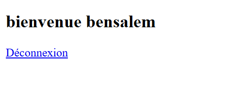
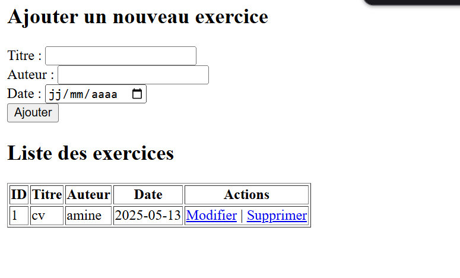
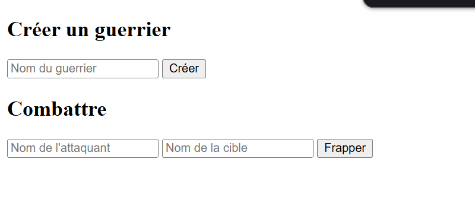

<h1>Exercice 1</h1>
Créez les pages PHP suivantes :

TP : PHP

- la première login.php présente un formulaire qui ressemble à celui-ci

<h1>Exercice 2</h1>

On souhaite développer une application qui permet à l'utilisateur d'effectuer les différentes opérations
CRUD sur la table "exercice": exercice (id , titre, auteur, date_creation)

<h1>Exercice 3</h1>
L’objectif de cet exercice est de créer un mini jeu de combat. Il s’agit de mettre en place
d’abord une conception en termes de classes à créer et de tables à créer puis de coder les
scripts nécessaires pour jouer un tour avec ce jeu (un tour est joué avec deux guerriers).
Chaque visiteur pourra créer un guerrier avec lequel il pourra frapper d’autres guerriers. Le
guerrier frappé se verra infliger un certain degré de dégâts.
Un guerrier est défini selon 2 caractéristiques :
— Son nom (unique).
— Ses dégâts.
Les dégâts d’un guerrier sont compris entre 0 et 100. Au début, il a bien entendu 0 de dégât.
Chaque coup qui lui sera porté lui fera prendre 5 points de dégâts. Une fois arrivé à 100 points
de dégâts, le personnage est mort (on le supprimera alors de la base de données).
Un personnage doit pouvoir :
—Frapper un autre personnage ;
—recevoir des dégâts.

